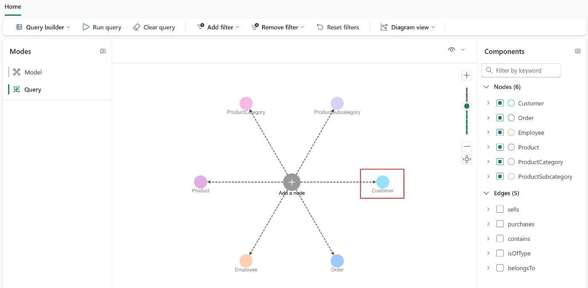

# Use Case 2 - Use Graph for advanced relationship analysis in Fabric IQ

**Introduction**
Modern retail enterprises manage highly interconnected data across customers, orders, products, employees, and vendors. While traditional relational analytics can answer direct questions, it often falls short when exploring complex, multi-hop relationships—such as understanding how customers are indirectly connected through shared purchases, how vendors influence product demand, or how product hierarchies impact sales patterns.
To overcome these limitations, this use case demonstrates how Graph capabilities in Microsoft Fabric IQ can be used to model business entities as nodes and their interactions as edges. By transforming relational data stored in OneLake into a graph model, analysts and data engineers can visually explore and query relationships that are difficult to uncover using tabular approaches. This relationship-centric analysis enables deeper insights into customer behavior, supplier dependencies, and product ecosystems, ultimately supporting smarter, data-driven decisions.Objective

**Objective**

-Create and configure a Microsoft Fabric workspace suitable for graph analytics

-Build a Lakehouse and ingest structured retail data from OneLake

-Create a Graph model in Microsoft Fabric IQ

-Define nodes to represent core business entities such as customers, products, orders, vendors, and employees

-Define edges to model real-world relationships between these entities

-Load and validate the graph for analysis

-Query the graph using both the Query Builder and Graph Query Language (GQL)

-Discover complex relationship patterns that go beyond traditional SQL-based analysis

## Task 1: Create a Fabric workspace

In this task, you create a Fabric workspace. The workspace contains all
the items needed for this lakehouse tutorial, which includes lakehouse,
dataflows, Data Factory pipelines, the notebooks, Power BI datasets, and
reports.

1.  Fabric home page, select **+New workspace** tile.


2.  In the **Create a workspace** pane that appears on the right side,
    enter the following details, and click on the **Apply** button.

  |  |   |
  |---|---|
  |Property|	Value|
  |Name	|+++Fabric_GraphXXX+++ (XXXmust be a unique Id)|
  |Advanced	|Under License mode, select Fabric capacity|
  |Default| storage format	Small dataset storage format|
  |Template apps|	Check the Develop template apps|


> 
>
> 

\[!note\]**Note**: To find your lab instant ID, select 'Help' and copy
the instant ID.

> 

3.  Wait for the deployment to complete. It takes 2-3 minutes to
    complete.

> 

## Task 2: Create a lakehouse

1.  Create a new lakehouse by clicking on the **+New item** button in
    the navigation bar.

> 

2.  Filter by, and select, the **+++Lakehouse+++** tile.


3.  In the **New lakehouse** dialog box,
    enter **+++Adventureworks+++** in the **Name** field
    and **unselect** the lakehouses schemas, click on
    the **Create** button and open the new lakehouse.

\[!note\]**Note**: Be sure to remove space before **Adventureworks**


4.  You will see a notification stating **Successfully created SQL
    endpoint**.


## Task 3: Ingest sample data

1.  In the lakehouse page, navigate to **Get data in your
    lakehouse** section, and click on **Upload files as shown in the
    below image.**

> 

2.  On the **Upload files** tab, click on the folder under the Files

> 

3.  Browse to **C:\LabFiles\LabFiles** on your VM, then
    select **adventureworks_docs_sample.zip** file and click
    on **Open** button.

> 

4.  Then, click on the **Upload** button and close the **Upload
    files** dialog by selecting the **X** icon for the dialog.

> 
>
> 

5.  Click and select refresh on the **Files**. The file appear.


6.  In **lakehouse** page, navigate and click on **Open notebook** drop
    in the command bar, then select **New notebook**.


2.  In the open notebook in **Lakehouse explorer**, you will see that
    the notebook is already linked to your opened lakehouse.

3.  Update the code in the **cell** with the following code and click
    on **Run cell** that appears to the left of the cell upon hover.
    ```
    import zipfile
    import os
    
    zip_path = "/lakehouse/default/Files/adventureworks_docs_sample.zip"
    extract_path = "/lakehouse/default/Files/extracted_data"
    
    os.makedirs(extract_path, exist_ok=True)
    
    with zipfile.ZipFile(zip_path, 'r') as zip_ref:
        zip_ref.extractall(extract_path)
    ```


7.  In the notebook toolbar, change the language from **PySpark
    (Python)** to **Spark SQL** to run SQL commands against the
    Lakehouse data.


8.  Use the **+ Code** icon below the cell output to add a new code cell
    to the notebook, and enter the following code in it. Click on **▷
    Run cell** button and review the output
  ```
  -- Drop tables if they already exist
  DROP TABLE IF EXISTS customers;
  DROP TABLE IF EXISTS employees;
  DROP TABLE IF EXISTS orders;
  DROP TABLE IF EXISTS productcategories;
  DROP TABLE IF EXISTS products;
  DROP TABLE IF EXISTS productsubcategories;
  DROP TABLE IF EXISTS vendorproduct;
  DROP TABLE IF EXISTS vendors;
  
  -- Create tables from Delta folders
  CREATE TABLE customers
  USING DELTA
  AS SELECT * FROM delta.`Files/extracted_data/adventureworks_customers`;
  
  CREATE TABLE employees
  USING DELTA
  AS SELECT * FROM delta.`Files/extracted_data/adventureworks_employees`;
  
  CREATE TABLE orders
  USING DELTA
  AS SELECT * FROM delta.`Files/extracted_data/adventureworks_orders`;
  
  CREATE TABLE productcategories
  USING DELTA
  AS SELECT * FROM delta.`Files/extracted_data/adventureworks_productcategories`;
  
  CREATE TABLE products
  USING DELTA
  AS SELECT * FROM delta.`Files/extracted_data/adventureworks_products`;
  
  CREATE TABLE productsubcategories
  USING DELTA
  AS SELECT * FROM delta.`Files/extracted_data/adventureworks_productsubcategories`;
  
  CREATE TABLE vendorproduct
  USING DELTA
  AS SELECT * FROM delta.`Files/extracted_data/adventureworks_vendorproduct`;
  
  CREATE TABLE vendors
  USING DELTA
  AS SELECT * FROM delta.`Files/extracted_data/adventureworks_vendors`;
  ```
>
> 
>
> 

9.  Now, click on workspace **Fabric_GraphXX** on the left-sided
    navigation pane.

> 

10. Refresh the lakehouse


## Task 4: Create a graph model

Graph in Microsoft Fabric uses the same workspace roles as other
Microsoft Fabric items. The following table summarizes the permissions
associated with each Microsoft Fabric workspace role's capability on
graph models.

To create a graph model in Microsoft Fabric, follow these steps:

1.  Now, click on workspace **Fabric_GraphXX** on the left-sided
    navigation pane.

> 

2.  Select **+ New item**.

> 

3.  In the **Filter by item type** search box, enter **+++**\> **Graph
    model+++** and select **Analyze and train data** \> **Graph model
    (preview)**.


** Tip:** Alternatively, enter "graph" in the search box and
press **Enter** to search for graph items.

4.  Enter **+++Adventure_Graph+++** as the Data agent name and
    select **Create**.

> 
>
> 

## Task 5: Create a graph

In graph view, you should see **Save**, **Add node**, and **Add edge**,
and **Get data** buttons.

To create a graph in Microsoft Fabric, follow these steps:

1.  In your graph model, select **Get data**.

> 

2.  From the **OneLake catalog**, select the **Adventureworks**
    lakehouse and select **Connect**.

> 

** Note:** This quickstart uses Adventure Works data as an example. Your
data set and results might differ.

3.  Select data tables and then select **Load**.

> 

4.  You should see data available for use in your graph.

> 
>
> ** Note:** Graph in Microsoft Fabric currently supports the following
> data types:

- Boolean (values are true and false)

- Double (values are 64-bit floating point numbers)

- Integer (values are 64-bit signed integers)

- String (values are Unicode character strings)

- Zoned DateTime (values are timestamps together with a timeshift for
  the time zone)

## Task 6: Start modeling

Now you can start modeling by adding nodes and edges to the graph. We
use the Adventure Works data model as an example.

> **Add nodes**
>
> In this section, we create nodes for each entity in the Adventure
> Works data model.
>
> To add the nodes to your graph, follow these steps:

1.  In your graph model, select **Add node** to add a new node to your
    graph.

> 

2.  In the **Add node to graph** dialog, enter the node label is
    "**Customer"**, the mapping table is "**customers**", and the
    mapping column is "**CustomerID_K**

|   |   |  |
|-----|----|---|
|Node label	|Mapping table|	Mapping column|
|Customer	|customers|	CustomerID_K|
|Order	|orders|	SalesOrderDetailID_K|
|Employee	|employees	|EmployeeID_K|
|Product|	products|	ProductID_K|
|ProductCategory	|productcategories	CategoryID_K|
|ProductSubcategory|	productsubcategories|	SubcategoryID_K|
|Vendor	|vendors|	VendorID_K|


3.  Select **Confirm** to add the node to your graph.

> 

4.  Repeat the process for all other nodes. You should see all the nodes
    represented in your graph.

> 
>
> 
>
> 
>
> 
>
> 

5.  Select **Save** to start generating your graph.

> 

## Task 7: Add edges

> In this task, we create edges to define the relationships between the
> nodes in the Adventure Works data model.
>
> To add the edges to your graph, follow these steps:

1.  Select **Add edge** to create a relationship between nodes.

> 

2.  In the **Add edge** dialog, select the mapping table, source and
    target nodes, and define the relationship.

3.  The edge is defined as "sells" with the mapping table "orders",
    connecting the source node "Employee" (EmployeeID_FK) to the target
    node "Order" (SalesOrderDetailID_K). Select **Confirm** to add the
    edge to your graph.

| Edge        | Mapping table         | Source node | Source node mapping column | Target node | Target node mapping column |
|-------------|-----------------------|-------------|-----------------------------|-------------|-----------------------------|
| sells       | orders                | Employee    | EmployeeID_FK               | Order       | SalesOrderDetailID_K        |
| purchases   | orders                | Customer    | CustomerID_FK               | Order       | SalesOrderDetailID_K        |
| contains    | orders                | Order       | SalesOrderDetailID_K        | Product     | ProductID_FK                |
| isOfType    | products              | Product     | ProductID_K                 | ProductSubCategory | SubcategoryID_FK     |
| belongsTo   | productsubcategories  | ProductSubCategory | SubcategoryID_K     | ProductCategory | CategoryID_FK        |
| produces    | vendorproduct         | Vendor      | VendorID_FK                 | Product     | ProductID_FK                |


> 
>
> 

4.  Repeat the process for all other edges. You should see all the edges
    represented in your graph.

> 
>
> 
>
> 
>
> 
>
> 
>
> 
>
> 
>
> 
>
> 
>
> 
>
> 
>
> 
>
> 
>
> 

5.  Repeat the process for all other edges. You should see all the edges
    represented in your graph.

> 
>
> By this point, you created all the nodes and edges for your graph.
> This is the basic structure of your graph model.

## Task 8: Load the graph

1.  To load the graph, select **Save**. This will verify the graph
    model, load data from OneLake, construct the graph, and ready it for
    querying.

> 
>
> 
>
> ** Important:** You currently need to reload the graph (by
> selecting **Save**) whenever the model or the underlying data is
> changed.
>
> **Query the graph**
>
> Graph in Microsoft Fabric uses the same workspace roles as other
> Microsoft Fabric items. The following workspace role permissions apply
> depending on whether you run queries via the Graph Model or QuerySet
> item.
>
> ** Note**
>
> All users need read access to the underlying graph instance item to
> execute queries against the referenced graph instance from the graph
> QuerySet item. Only read, write, and reshare permissions are supported
> for QuerySet item.

## Task 9: Using the query builder

> Now, we can query the graph by selecting specific nodes and
> relationships. All queries are based on the graph structure that [we
> built in the previous
> section.](https://learn.microsoft.com/en-us/fabric/graph/quickstart#start-modeling).
>
> Follow these steps to switch to query builder and start querying your
> graph interactively:

1.  Select **Modes** \> **Query builder** from your graph's home page.
    From this view, you can also create a read-only queryset, which has
    the same functionalities as below and allows you to share your query
    results.

> 

2.  Select **Add node** to see the available nodes for querying.

> 
>
> 

3.  Select a node to add it to your query. In this example, we add
    the **Customer** node.

> 

4.  From here you can build your query by adding nodes and edges,
    applying filters, and selecting properties to return in the results.

> **Using the code editor**
>
> We can also query the graph using the GQL graph query language.
>
> Follow these steps to switch to code editor and start querying your
> graph using GQL:

5.  Select **Query builder** \> **Code editor** from your graph's home
    page.

> 

6.  Enter a GQL query into the input field, such as +++MATCH
    (n:\`Order\`) RETURN count(n) AS num_orders+++. Select **Run
    query** to execute the query.


7.  Click on **Clear query**

> 

8.  You can also run more complex queries, such as queries that combine
    matching graph patterns, filtering, aggregation, sorting, and top-k
    limiting:

> gql
>
> MATCH
> (v:Vendor)-\[:produces\]-\>(p:\`Product\`)-\>(sc:\`ProductSubcategory\`)-\>(c:\`ProductCategory\`),
>
> (o:\`Order\`)-\[:\`contains\`\]-\>(p)
>
> FILTER c.categoryName = 'Components'
>
> LET vendorName = v.vendorName, subCategoryName = sc.subCategoryName
>
> RETURN vendorName, subCategoryName, count(p) AS num_products, count(o)
> AS num_orders
>
> GROUP BY vendorName, subCategoryName
>
> ORDER BY num_orders DESC
>
> LIMIT 5
>
> 
>
> 


